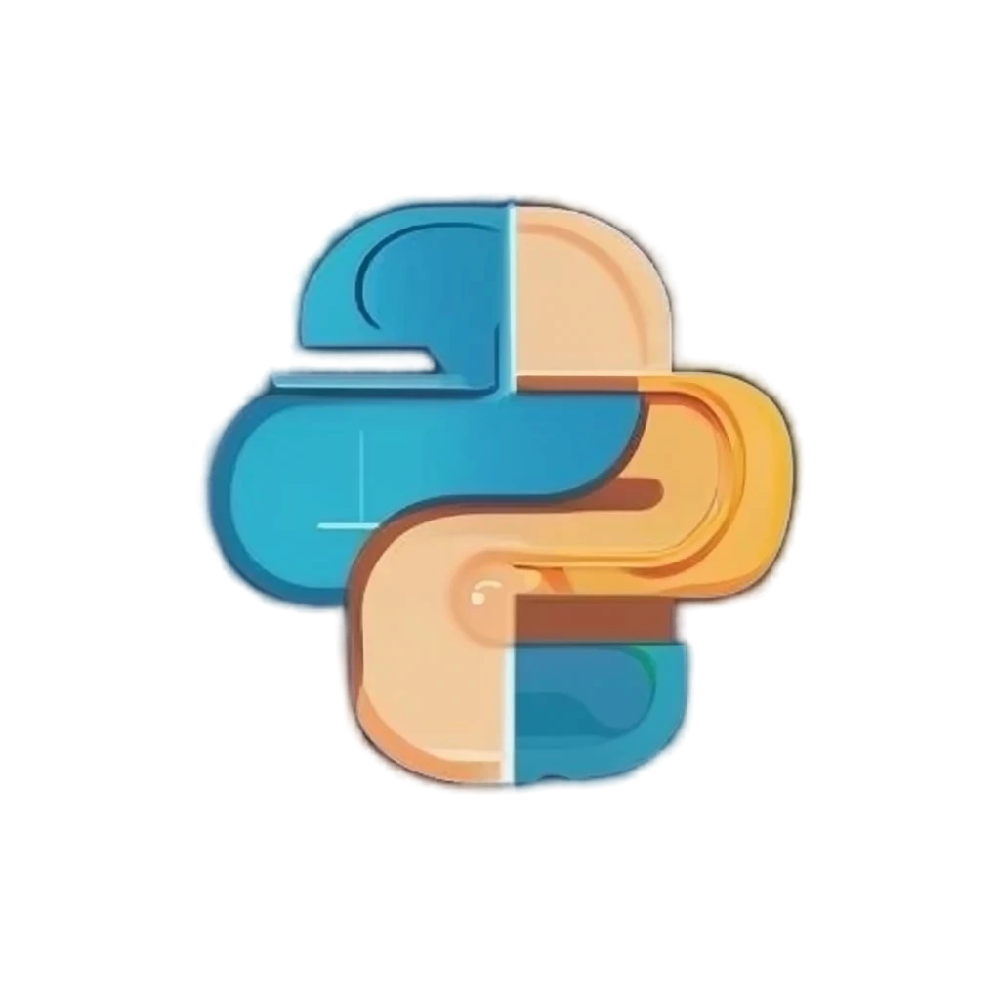

  

<h1>Simple Python Template</h1>

## Download

Go to [`Download and Installation`](./how-to-use/download.md) to find out how to download and use this template repository.

## Why write this?

Building a C extension module can be a challenging task, but it offers significant benefits, especially when it comes to performance. C extension modules allow developers to write portions of their Python code in C, enabling much faster execution of critical sections due to C's lower-level access and optimization capabilities. This is particularly important for computationally intensive tasks where Python's inherent limitations in execution speed can be a bottleneck.

Here are some challenges a beginner to writing C extensions might face:

Complexity of Python's C API:

- Python’s C API is vast and can be quite complex for beginners. It requires a deep understanding of reference counting, memory management, and error handling in a way that is compatible with Python's garbage collector.
- Improper memory management can lead to memory leaks or segmentation faults, which are difficult to debug.

!!! Example of Segfault
    File "/root/.pyenv/versions/3.8.19/lib/python3.8/runpy.py", line 87 in _run_code

    File "/root/.pyenv/versions/3.8.19/lib/python3.8/runpy.py", line 194 in _run_module_as_main

    make: *** [Makefile:25: test-all] Segmentation fault

- Setting up the build configuration correctly can be tedious, especially for developers who are not familiar with tools like `distutils`, `setuptools`, `Cython` or `pyproject.toml`.
- Ensuring that the extension works across different Python versions and operating systems can be challenging due to differences in compilers, build tools, and the Python interpreter itself.
- Proper documentation is often overlooked but is essential for maintainability and usability.

Hence, this template aims to make it easier for developers to start writing C extensions for Python with the following goals:

- Provides a cross-platform setup, including conditional compilation directives and configuration scripts that handle different environments gracefully. This ensures that the extension is portable and reduces the need for platform-specific adjustments, reducing the learning curve and potential for mistakes. This is encapsulated in the `build.py` under the `PROJECT_ROOT_DIR` (i.e. `/simple-python-template`).

- Provides a pre-configured build setup which streamlines the process. It includes necessary compiler flags, library dependencies, and setup scripts, saving time and reducing the likelihood of configuration errors.

- Includes sample tests and debugging tips in the template helps developers verify that their extension works correctly. This can include examples of using tools like gdb for debugging and pytest for automated testing. This is placed under the `tests` directory.

- Provides a starting point for documentation (using `mkdocs` and `Netlify`), including instructions on how to build and install the extension, as well as usage examples. This ensures that users and future developers can understand and use the extension effectively. With examples to set it up using `mkdocs.yml`, `requirements.txt` and `runtime.txt`.

It is my wish that you can use this template to bootstrap your next great amazing Python library.
